Photometric Stero
=====

The math base of "Photometric Stero" can be easily got from Internet. You can experiment with the code and the materials here. And be careful to change the path in the main function of this code. 
I write `PhotometricStero` class and `test` and do some change to the PFMAccess from Dr.Qin. 
Below is the record of my idea. 

## Calculate the Normal map and Albedo map
* I use the `PFMAccess` to access the data in the `.pbm` file. Notice that the destructor of PFMAccess class will destroy the data in the float pointer, which is very dangerous. Thus I prohibit the copy constructor of the class. So, the vector can only store its pointer. Also remember to free the PFMAccess later. 
* Then I use the float data to construct the opencv Mat `Mat (int rows, int cols, int type, void *data, size_t step=AUTO_STEP)`, it can use the float data from the PFMAccess directly. 
* Also remember that the copy constructor of Mat is like `std::shared_ptr`. So you don't need to fear that redundant data copy. 
* I choose one mask of metal phere to get the max position of the phere to get the light direction. 
* Here, the `void	cv::minMaxLoc (InputArray src, double *minVal, double *maxVal=0, Point *minLoc=0, Point *maxLoc=0, InputArray mask=noArray())` is very useful since I can directly set the mask as one parameter. 
* Here, to get the circle of metal phere, I use `cv::findContours` to get the contour of the sphere. In order to avoid the potential noise, I adopt the contours with most points. Then, I initialize the position of circle center with the average position of circle points, and radius with the average distance of some points to the initial center. And I use some points to iterate to get the precise circle center and radius. 
* Then I use the brightest point on the lambertian phere to get the light intensity. 
* With the light direction and intensity, I get the normal and albedo. 
* Because the high error of the dark point on the object. Dr.Qin recommends us to omit 10% darkest points in every image. So I use the quickSort algorithm to every image to get the 10% threshold. And these dark points won't attend later calculation. 
* And since the calculation needs at least 3 images to get the normal direction and albedo. I count the invalid image for every pixel. And only if valid image of one pixel is more than 3, this pixel will be calculated. Otherwise its value will be zero. 
* Then I use the matrix operation to get normal and albedo. We should notice here that we should normalize every pixel value with the source intensity of image. Moreover, since most pixels on the object is valid for all images, the pseudo-inverse of the whole L is usually used. So, I calculate it before the iteration. 

### effect:
When I map the normal to picture, I use the method mentioned in the `./Assignment_1/Assignment_1.pdf`.

| image type |apple | elephant | pear |
| ---------------|-------- | ---------- | ------------|
| normal map |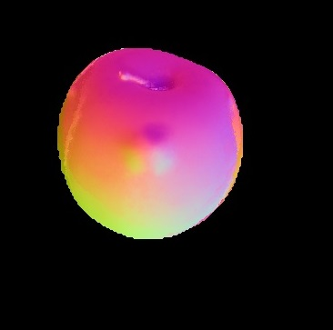 | 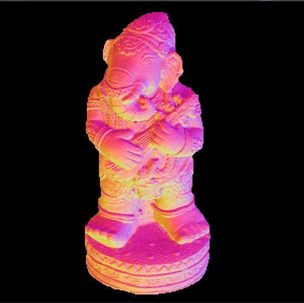 | 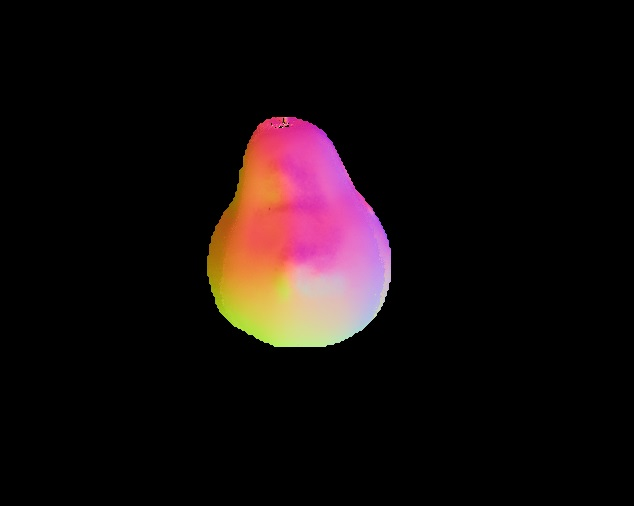|
| albedo map | 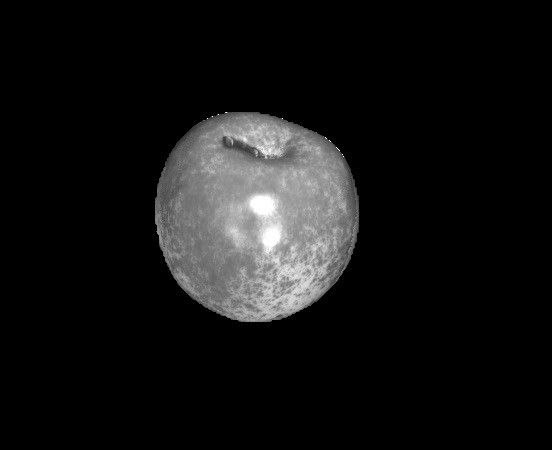 | 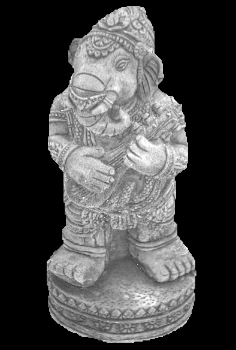 | 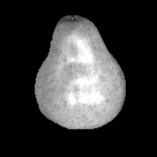|
| normal with albedo map | 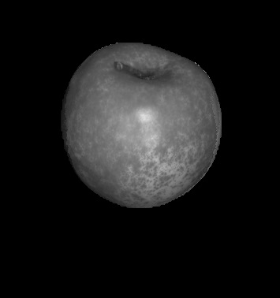 | 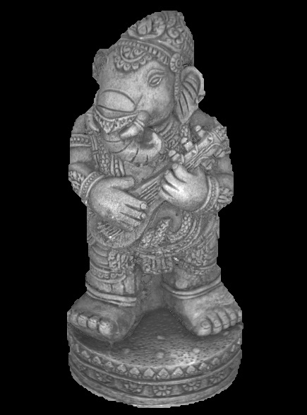 | 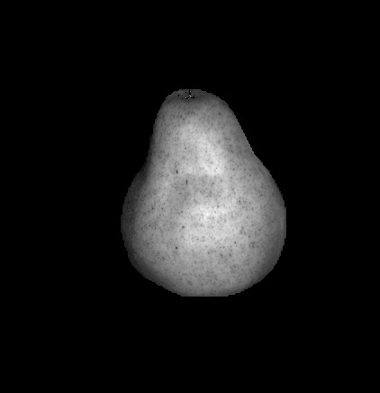|

## Calculate the depth of every pixel
* For these invalid point which doesn't have normal, I take one `3*3` window and assign the average normal direction to the invalid point. 
* With every normal direction (nx, ny, nz) of every pixel, we have `(nx, ny, nz).dot((z(x+1, y)) - (z(x, y))) = 0, (nx, ny, nz).dot(z(x, y+1) - z(x, y)) = 0`. Thus we have `number_of_points * 2` equations. 
* When I try to solve the equation `Pz = b`, the rank of P is `number_of_points - 1`. Thus, I set the depth of the point with median index to be zero and move it to constant matrix `b`. 
* The parameter matrix `P` is of size `number_of_points * 2, number_of_points - 1`. So we have to create sparse matrix to solve the linear equation. I use `Eigen` library to solve it. 
* In the equation, if `nz` of one point is near to 0, the equation will be unstable. Thus, I make one judgement: `when nz is smaller than one constant, than add one small number to it`. I don't know if it is mathematically right. If you have better idea, please contact me at `xinyuan.gui95@gmail.com`. 

### Depth effect
It's kind of hard to map the depth to 2d-image because the depth of the object varies a lot. I try to use linear function and sigmoid function to map. 
#### linear transform without judgement of nz
| apple | elephant | pear |
| ---------------|-------- | ---------- |
| 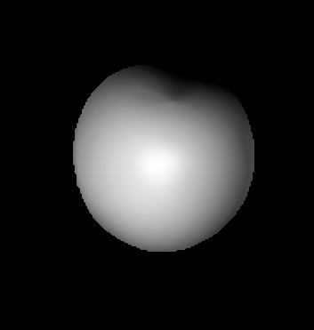 | 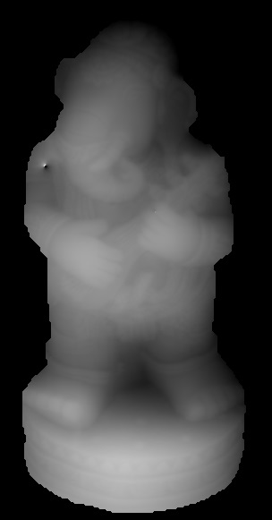 | 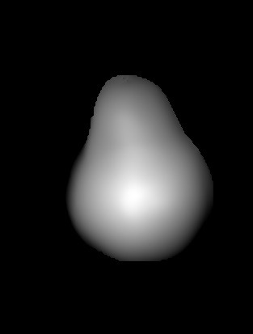|

#### sigmoid transform with and without judgement of nz
|elephant with judgement of nz | elephant without judgement|
|------------------------------|---------------------------|
| 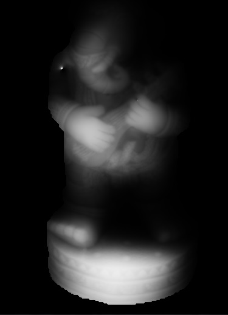 | 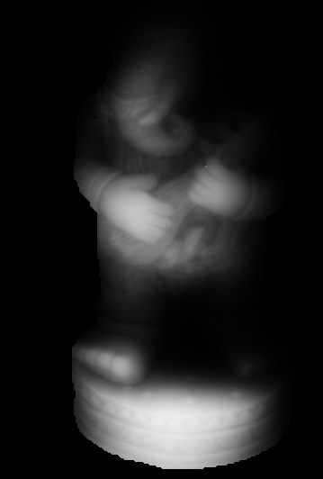|

From the picture, we can see that the judgement decreases the outlier to some extent. 

### How to use
* In order to use it, you should have correctrly installed the `openCV` and `Eigen` library. 
* The main class is in `PhotometricStero.h` and `PhotometricStero.cc`. 
* The `testPhotometricStero.cpp` contains the `main` function and some examples. You should be careful to change the path. 

If you have any question, contact me at `xinyuan.gui95@gmail.com`
